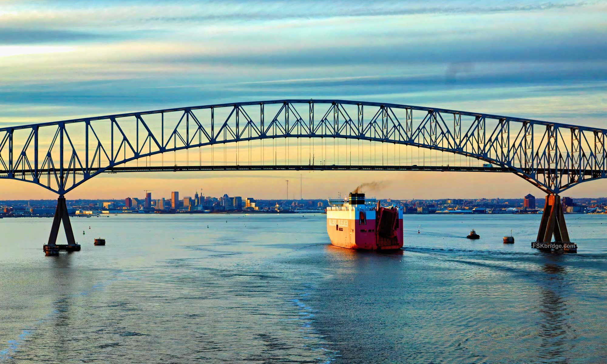
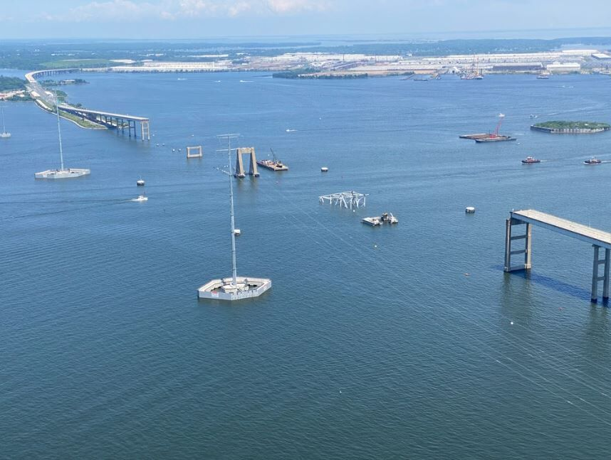
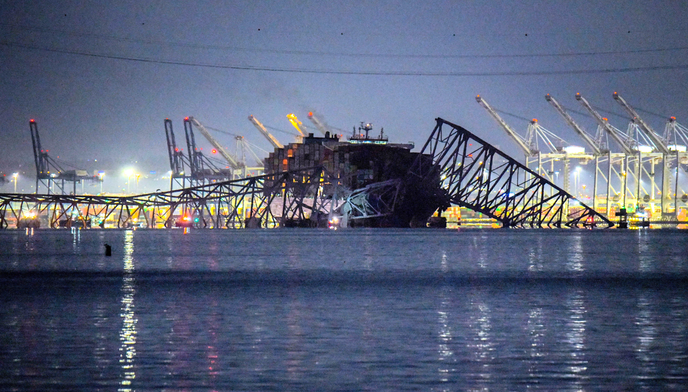

# Motivation

## The Before

{height=350px}

:::incremental
- Francis Scott Key bridge
- Baltimore, Maryland
:::

## The After

{height=350px}

. . .

- What caused this? 

## What happened?

{height=350px}

:::incremental
- Could this happen again? 
- Could it happen in Nebraska?
:::

# Methods

1. Selecting variables from National Bridge Inventory
2. Cluster to create potential groupings
3. Look at nearest neighbors to find most similar bridges

## Selecting Variables {.smaller}


```{r}
#| echo: false

library(tidyverse)

bridges = read.csv("NTAD_National_Bridge_Inventory_5655614151403109778.csv")

ne_bridges = bridges %>% 
  filter(STATE_CODE_001 == 31, DECK_COND_058 != "N",
         SUBSTRUCTURE_COND_060 != "N", SUPERSTRUCTURE_COND_059 != "N",
         SERVICE_UND_042B %in% c("5","6","7","8","9")) %>%
  dplyr::select(COUNTY_CODE_003,RECORD_TYPE_005A,YEAR_BUILT_027,TRAFFIC_LANES_ON_028A,
         TRAFFIC_LANES_UND_028B,ADT_029,YEAR_ADT_030,SERVICE_UND_042B,
         MAX_SPAN_LEN_MT_048,STRUCTURE_LEN_MT_049,ROADWAY_WIDTH_MT_051,
         DECK_WIDTH_MT_052,VERT_CLR_OVER_MT_053,DECK_COND_058,
         SUPERSTRUCTURE_COND_059,SUBSTRUCTURE_COND_060,LATDD,LONGDD) %>%
   rename(YearBuilt = YEAR_BUILT_027, MaxSpan = MAX_SPAN_LEN_MT_048, 
         ADT = ADT_029, DeckCond = DECK_COND_058, 
         SuperstructureCond = SUPERSTRUCTURE_COND_059, 
         SubstructureCond = SUBSTRUCTURE_COND_060) %>%
  mutate(IsOmaha = (COUNTY_CODE_003 == 55), DeckCond = as.numeric(DeckCond), 
         SuperstructureCond = as.numeric(SuperstructureCond), SubstructureCond = as.numeric(SubstructureCond)) 

omaha_bridges = ne_bridges %>%
  filter(COUNTY_CODE_003 == 55) %>%
  dplyr::select(-c(IsOmaha, COUNTY_CODE_003, RECORD_TYPE_005A))

scottkey = bridges %>%
  filter(STATE_CODE_001 == 24, ROUTE_PREFIX_005B == 1, 
         MAX_SPAN_LEN_MT_048 > 350, YEAR_BUILT_027 == 1976) %>%
  dplyr::select(YEAR_BUILT_027,TRAFFIC_LANES_ON_028A,
         TRAFFIC_LANES_UND_028B,ADT_029,YEAR_ADT_030,SERVICE_UND_042B,
         MAX_SPAN_LEN_MT_048,STRUCTURE_LEN_MT_049,ROADWAY_WIDTH_MT_051,
         DECK_WIDTH_MT_052,VERT_CLR_OVER_MT_053,DECK_COND_058,
         SUPERSTRUCTURE_COND_059,SUBSTRUCTURE_COND_060,LATDD,LONGDD) %>%
  rename(YearBuilt = YEAR_BUILT_027, MaxSpan = MAX_SPAN_LEN_MT_048, 
         ADT = ADT_029, DeckCond = DECK_COND_058, 
         SuperstructureCond = SUPERSTRUCTURE_COND_059, 
         SubstructureCond = SUBSTRUCTURE_COND_060) %>%
  mutate(DeckCond = as.numeric(DeckCond), 
         SuperstructureCond = as.numeric(SuperstructureCond), SubstructureCond = as.numeric(SubstructureCond)) 
```

::: columns
::: {.column width="35%"}
#### National Bridge Inventory

Data were extracted from the National Bridge Inventory maintained by the United States' Department of Transit. Records are last updated in 2025 and filtered by state and county codes.
:::

::: {.column width="3%"}
:::

::: {.column width="62%"}
```{r}
knitr::kable(head(ne_bridges)[,c("YearBuilt",	"ADT", "MaxSpan", "DeckCond")])
```
:::
:::

::: footer
Variables shown do not include all variables used in analysis.
:::

## Clustering

```{r}
#| echo: false

library(rgl)
library(MASS)
library(caret)

set.seed(343)

kmeans_result <- kmeans(scale(omaha_bridges %>% dplyr::select(-c(LONGDD, LATDD))), centers = 3, nstart = 25)
omaha_bridges$Cluster <- as.factor(kmeans_result$cluster)

pre_proc <- preProcess(omaha_bridges %>% 
                         dplyr::select(-c(Cluster, LONGDD, LATDD)), method = c("center", "scale"))
omaha_scaled <- predict(pre_proc, omaha_bridges %>% 
                          dplyr::select(-c(Cluster, LONGDD, LATDD)))

pca_result <- prcomp(omaha_scaled, scale. = FALSE)
pca_data <- as.data.frame(pca_result$x[, 1:2])
pca_data$Cluster <- omaha_bridges$Cluster

# Project scottkey into the same PCA space
scottkey_scaled <- predict(pre_proc, scottkey %>% dplyr::select(-c(LONGDD, LATDD)))
scottkey_pca <- as.data.frame(predict(pca_result, scottkey_scaled)[, 1:2])
scottkey_pca$Cluster <- "Scott Key"

# Frame 1: clusters only, Frame 2: clusters + scottkey
pca_data$frame <- 1
scottkey_pca$frame <- 2

# Force it to be a single row data frame
scottkey_pca <- as.data.frame(t(predict(pca_result, scottkey_scaled)[1:2]))
colnames(scottkey_pca) <- c("PC1", "PC2")
scottkey_pca$Cluster <- "Scott Key"

pca_combined <- bind_rows(
  pca_data,
  pca_data %>% mutate(frame = 2),  # keep cluster points in frame 2
  scottkey_pca
)


# Plot
ggplot(pca_combined, aes(x = PC1, y = PC2, color = Cluster)) +
  geom_point(size = 3) +
  labs(title = "K-Means Clustering with PCA",
       x = "Principal Component 1",
       y = "Principal Component 2") +
  theme_minimal()
```

## What do the clusters mean? {.smaller}

#### Most Influential Variables in Clusters 

- Cluster 1
  - Superstructure Condition\*, Deck Condition\*, Substructure Condition\*, Year Built\*, Maximum Span\*, Year the Average Daily Traffic Metric was taken\*
- Cluster 2
  - Superstructure Condition\*, Deck Condition, Substructure Condition, Year Built, Average Daily Traffic, Number of Traffic Lanes Underneath\*
- Cluster 3
  - Average Daily Traffic, Maximum Span, Structure Length, Roadway Width, Number of Traffic Lanes Underneath, Deck Width

::: footer
A \* indicates that the cluster tends to have below average values in comparison with the rest of the data set
:::

## Most Similar Bridges

```{r}
library(FNN)

# Split into training and test sets
trainIndex = createDataPartition(omaha_bridges[,1], p = 0.8, list = FALSE)
trainData = omaha_bridges[trainIndex, ] %>% 
  dplyr::select(-Cluster)
testData = omaha_bridges[-trainIndex, ] %>% 
  dplyr::select(-Cluster)

k = 5
nn_result = get.knnx(data = trainData, query = scottkey, k = k)


neighbors = trainData[nn_result$nn.index[1, ], ]
neighbors %>%
  dplyr::select(YearBuilt, ADT, MaxSpan, DeckCond)
```

:::incremental
- Only 4 variables
- Meaningless as is
- Where are they?
:::

## Most Similar Bridges - Graphed

```{r}
library(tigris)
library(sf)

ne_counties = counties(state = "NE", cb = TRUE, progress_bar = FALSE)
douglas = ne_counties %>% filter(NAME == "Douglas")

library(nhdplusTools)

big_pap_nhd <- get_nhdplus(AOI = st_transform(douglas, 4326), 
                           realization = "flowline") %>%
  filter(str_detect(gnis_name, "Papillion"))

ggplot() +
  geom_sf(data = douglas) +
  geom_sf(data = big_pap_nhd, color = "blue", linewidth = 0.7) +
  geom_point(data = neighbors, aes(x = LONGDD, y = LATDD),
             color = "red", size = 2, alpha = 0.6) +
  theme_minimal() +
  labs(x = "Longitude",y = "Latitude",title = "Top 5 Most Similar Bridges in Omaha")
```

# What Now?

:::incremental
- Further research into other bridge collapse events
- We are not at risk for such an incident
:::

# Thank You

Opening the floor for questions
